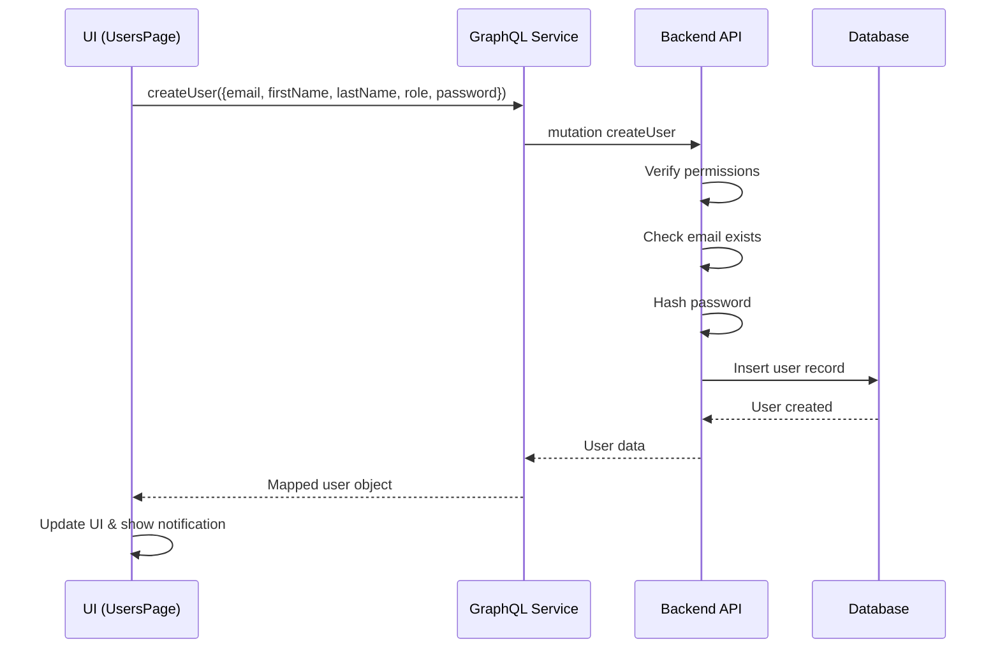

# Guia de Criação de Usuários

## Visão Geral

A página de usuários (`UsersPage`) agora está completamente integrada com o backend GraphQL para criar novos usuários de forma funcional.

## Funcionalidades Implementadas

### 1. **Criação de Usuários**
- A criação de usuários está agora conectada ao backend via GraphQL
- Utiliza a mutation `createUser` definida no schema de gerenciamento
- Senha padrão gerada automaticamente: **`Smartbi@123`**

### 2. **Backend (Arquivos de Referência)**

#### Schema GraphQL (`management.schema.ts`)
```graphql
input CreateUserInput {
  email: String!
  firstName: String!
  lastName: String!
  role: UserRole!
  password: String!
}

extend type Mutation {
  createUser(input: CreateUserInput!): UserResponse!
}
```

#### Resolver (`management.resolvers.ts`)
- Verifica autenticação e permissões (apenas `COMPANY_ADMIN` ou `SUPER_ADMIN`)
- Valida se o email já existe
- Cria o usuário com senha hash
- Retorna o usuário criado

#### Service (`management.service.ts`)
- Método `createUser` implementado
- Hash de senha usando `PasswordService`
- Inserção no banco de dados Supabase
- Email verification inicial definido como `false`

### 3. **Frontend**

#### GraphQL Service (`src/services/graphqlService.ts`)
Novo método adicionado:
```typescript
async createUser(input: {
  email: string;
  firstName: string;
  lastName: string;
  role: string;
  password: string;
}): Promise<User>
```

#### Users Page (`src/components/Users/UsersPage.tsx`)
- Função `handleSaveUser` atualizada para ser assíncrona
- Ao criar novo usuário:
  1. Usa senha padrão `Smartbi@123`
  2. Mapeia role da UI para o backend (ex: `'admin'` → `'COMPANY_ADMIN'`)
  3. Chama `graphqlService.createUser()`
  4. Mapeia usuário retornado para formato da UI
  5. Atualiza lista local de usuários
  6. Mostra notificação de sucesso com a senha padrão

## Como Usar

### Na Interface

1. **Acesse a página de Usuários**
   - Navegue para `/users` no sistema

2. **Clique em "Add User"** ou botão equivalente
   - Modal de criação será aberto

3. **Preencha os campos**:
   - **Nome**: Nome completo do usuário
   - **Email**: Email válido (será usado para login)
   - **Role**: Escolha entre Admin, Manager, Analyst ou Viewer
   - **Department**: Departamento do usuário
   - **Status**: Ativo, Inativo ou Pendente

4. **Salve o usuário**
   - A senha padrão `Smartbi@123` será atribuída automaticamente
   - Uma notificação aparecerá informando a senha padrão

5. **Compartilhe credenciais com o usuário**:
   - Email: [email preenchido]
   - Senha: `Smartbi@123`
   - Oriente o usuário a alterar a senha no primeiro login

## Mapeamento de Roles

| UI Role | Backend Enum | Permissões |
|---------|--------------|------------|
| `admin` | `COMPANY_ADMIN` | Gerenciar usuários da empresa |
| `manager` | `MANAGER` | Gerenciar equipe e projetos |
| `analyst` | `ANALYST` | Análise de dados |
| `viewer` | `VIEWER` | Apenas visualização |

## Segurança

### Senha Padrão
- **Senha**: `Smartbi@123`
- ⚠️ **IMPORTANTE**: Esta é uma senha temporária
- O usuário deve alterá-la no primeiro acesso
- Recomenda-se implementar força de senha na alteração

### Permissões
- Apenas `COMPANY_ADMIN` e `SUPER_ADMIN` podem criar usuários
- Usuários criados pertencem automaticamente à empresa do criador
- Email verification inicial: `false`

## Fluxo Técnico



## Próximos Passos Recomendados

1. **Implementar atualização de usuários**
   - Adicionar mutation `updateUser` no handleSaveUser quando `editingUser` existe

2. **Implementar exclusão de usuários**
   - Conectar `handleConfirmDelete` com backend
   - Adicionar mutation `deleteUser`

3. **Reset de senha**
   - Adicionar opção "Resetar Senha" que gera nova senha temporária
   - Enviar email com nova senha

4. **Validação de email**
   - Implementar fluxo de verificação de email
   - Enviar link de ativação

5. **Força de senha**
   - Adicionar política de senha forte
   - Exigir troca de senha no primeiro login

## Troubleshooting

### Erro: "Authentication required"
- Verifique se o usuário está logado
- Token JWT pode ter expirado

### Erro: "Insufficient permissions"
- Apenas COMPANY_ADMIN e SUPER_ADMIN podem criar usuários
- Verifique o role do usuário logado

### Erro: "User with this email already exists"
- Email já está cadastrado no sistema
- Use email diferente ou recupere senha do usuário existente

### Erro na criação mas usuário não aparece
- Verifique logs do console (F12)
- Mutation pode ter falhado no backend
- Recarregue a página para buscar lista atualizada

## Build Status

✅ **Build testado e funcionando**
- Compilação Vite: Sucesso
- TypeScript: Sem erros de tipo
- PWA: Gerado corretamente

---

**Data de atualização**: Outubro 2025  
**Versão**: 1.0.0
